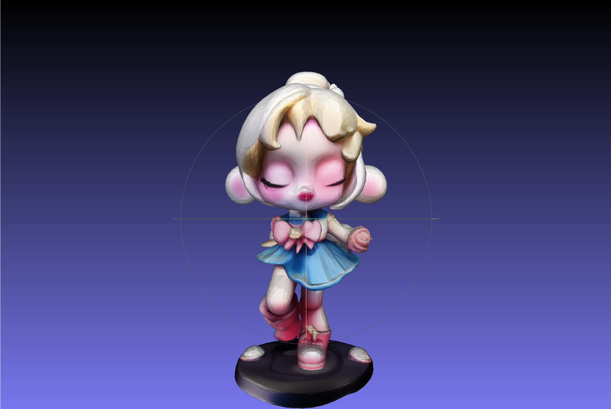
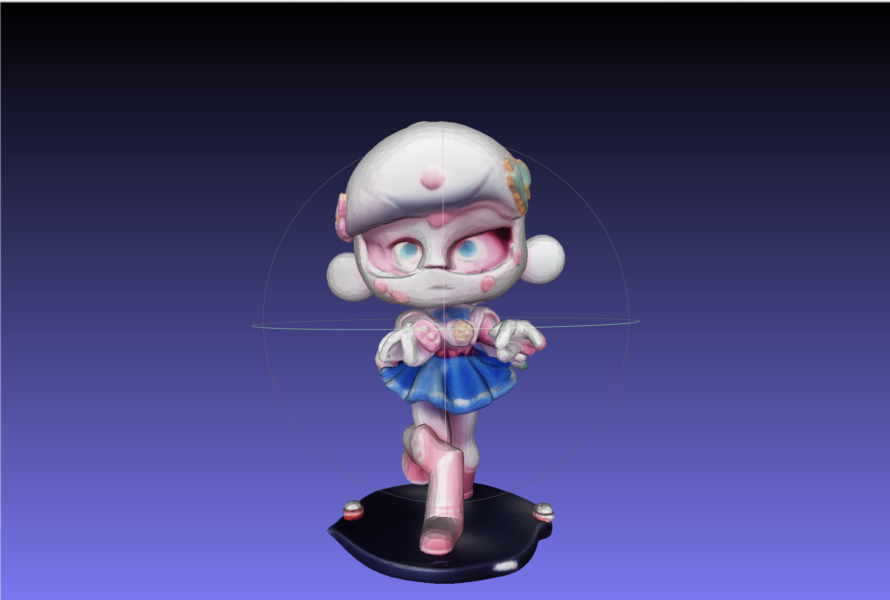
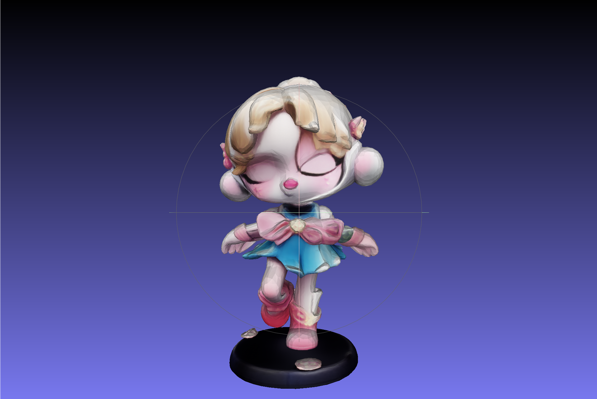
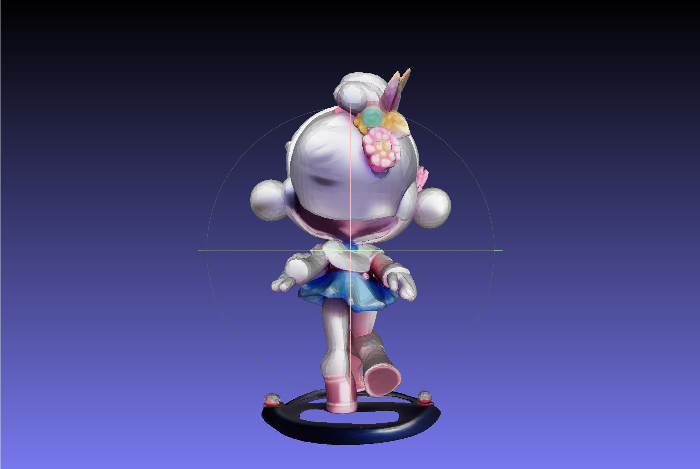
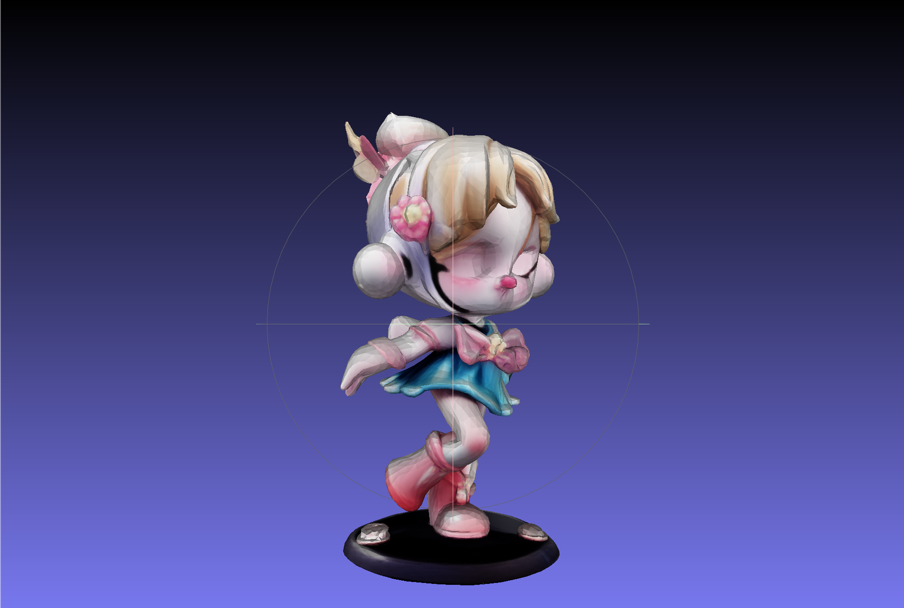

# TRELLIS Extensions

Extensions built on top of [TRELLIS](https://github.com/microsoft/TRELLIS) for two practical directions:

- rotation-aligned sparse-structure supervision
- LoRA fine-tuning for vehicle and high-speed rail generation

The codebase keeps the original TRELLIS pipeline intact and adds lightweight extensions for data preparation, training, and inference.

## Results

Input views:

| View 1 | View 2 | View 3 |
| --- | --- | --- |
|  |  |  |

Before fine-tuning:

| Output 1 | Output 2 | Output 3 |
| --- | --- | --- |
|  |  |  |

After fine-tuning:

| Output 1 | Output 2 | Output 3 |
| --- | --- | --- |
|  |  |  |

## Features

- Rotation-aligned stage1 supervision for image-conditioned training
- Per-view sparse-structure latent encoding
- LoRA fine-tuning for TRELLIS stage1 and stage2
- Unified inference script for `base/base`, `lora/base`, and `lora/lora`
- Multi-image inference with `multidiffusion`
- CRRC batch evaluation scripts

## Structure

```text
configs/generation/
  ss_flow_img_dit_L_16l8_fp16_views_lora_bs4_split2.json
  ss_flow_img_dit_L_16l8_fp16_crrc_lora_bs4_split2.json
  slat_flow_img_dit_L_64l8p2_fp16_crrc_lora_bs4_split4.json

dataset_toolkits/
  encode_ss_latent_views.py

scripts/
  inference/
    example_lora.py
    example_save_stage1_lora.py
    run_crrc_multiimage_pairs.sh
  train/
    train_crrc_stage1_resume.sh
    train_crrc_stage2_resume.sh

trellis/datasets/
  sparse_structure_latent_views.py

trellis/modules/lora/
  linear.py
```

## Workstreams

### Rotation Alignment

The goal is to make stage1 supervision view-aligned instead of using a single scene-level canonical target.

Pipeline:

1. Rotate mesh into the target view.
2. Voxelize the rotated mesh.
3. Encode each view-specific voxel into a sparse-structure latent.
4. Train with image-view and latent-view correspondence.

Key files:

- `dataset_toolkits/encode_ss_latent_views.py`
- `trellis/datasets/sparse_structure_latent_views.py`
- `configs/generation/ss_flow_img_dit_L_16l8_fp16_views_lora_bs4_split2.json`

### Vehicle / CRRC Fine-tuning

The goal is to adapt TRELLIS to vehicle and high-speed rail data with LoRA while keeping inference simple and comparable.

Current support:

- stage1 LoRA fine-tuning
- stage2 LoRA fine-tuning
- single-image inference
- multi-image inference
- CRRC comparison scripts

Key files:

- `configs/generation/ss_flow_img_dit_L_16l8_fp16_crrc_lora_bs4_split2.json`
- `configs/generation/slat_flow_img_dit_L_64l8p2_fp16_crrc_lora_bs4_split4.json`
- `scripts/train/train_crrc_stage1_resume.sh`
- `scripts/train/train_crrc_stage2_resume.sh`
- `scripts/inference/example_lora.py`
- `scripts/inference/run_crrc_multiimage_pairs.sh`

## Quick Start

### Train

Stage 1:

```bash
python train.py --config configs/generation/ss_flow_img_dit_L_16l8_fp16_crrc_lora_bs4_split2.json \
  --data_dir <data_dir> \
  --output_dir <output_dir>
```

Stage 2:

```bash
python train.py --config configs/generation/slat_flow_img_dit_L_64l8p2_fp16_crrc_lora_bs4_split4.json \
  --data_dir <data_dir> \
  --output_dir <output_dir>
```

### Inference

Base model:

```bash
python scripts/inference/example_lora.py \
  --images <front.png> <right.png> \
  --output-dir <output_dir> \
  --multiimage-mode multidiffusion
```

LoRA model:

```bash
python scripts/inference/example_lora.py \
  --images <front.png> <right.png> \
  --stage1-ckpt <stage1_ckpt> \
  --stage2-ckpt <stage2_ckpt> \
  --output-dir <output_dir> \
  --multiimage-mode multidiffusion
```

Batch CRRC evaluation:

```bash
bash scripts/inference/run_crrc_multiimage_pairs.sh
```

## Notes

- `example_lora.py` supports `base/base`, `lora/base`, and `lora/lora`
- `multidiffusion` is the recommended default for multi-view vehicle inputs
- exported `sample.glb` uses baked appearance from generated representations rather than original source PBR materials

## Acknowledgements

This project is based on TRELLIS from Microsoft Research.
